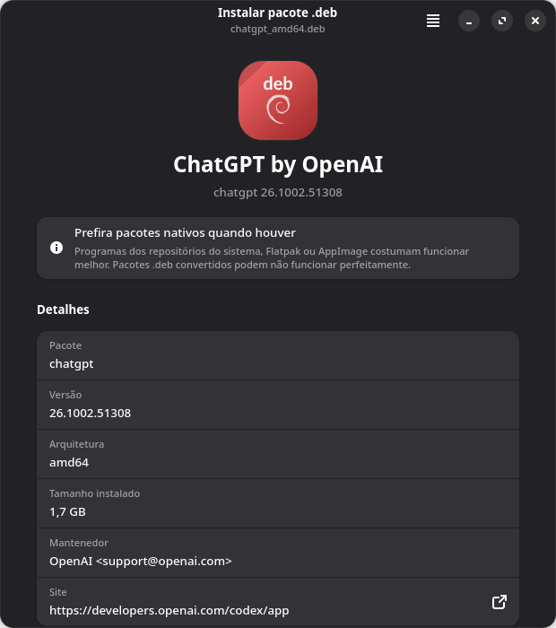

# debtap-mod

**Install `.deb` packages on Arch-based systems, the native way.**

debtap-mod converts Debian packages into real pacman packages and installs
them. Open a `.deb` file, click **Install**, and the application appears in
your menu, tracked by pacman like any other package.

<p align="center">
  
  &nbsp;
  
</p>

> **Prefer native packages when they exist.** Software from the official
> repositories, Flatpak or AppImage is built for this system and will usually
> work better. debtap-mod is for programs that are only distributed as `.deb`.

---

## Features

- **Graphical installer** built with GTK4 and libadwaita. Opens on
  double-click, supports drag and drop, and shows real progress.
- **Accurate dependencies.** Reads the ELF binaries in the package instead of
  guessing from Debian package names.
- **Safe extraction.** Refuses paths that escape the package and keeps file
  modes, including setuid helpers such as `chrome-sandbox`.
- **Maintainer scripts that work.** Debian `preinst`/`postinst`/`prerm`/`postrm`
  scripts run with the arguments dpkg would use, backed by compatibility shims.
- **Standard packaging.** Packages are built by `makepkg` under fakeroot, so
  ownership, `.MTREE` and `.BUILDINFO` are correct and `pacman -Qkk` passes.
- **Honest results.** Success is reported only after pacman confirms the
  package is installed. Failures show the full log.
- **Command-line interface** compatible with the original `debtap` options.
- **Per-package fixes** kept as data in a TOML file, not as code.
- **apt / dnf command translator.** Commands typed out of habit (`apt install`,
  `dnf upgrade`, `dpkg -i`…) are translated: the equivalent pacman and pamac
  commands are shown, then the right one runs.

## Requirements

- An Arch-based distribution (BigLinux, Manjaro, Arch Linux, …)
- `python` ≥ 3.14, `python-gobject`, `gtk4`, `libadwaita`
- `pacman` (provides `makepkg`), `fakeroot`, `libarchive`, `zstd`
- `polkit` (for `pkexec`)
- Up-to-date pacman file databases (`pacman -Fy`). These give the best
  dependency resolution and are usually refreshed by the system automatically.

## Installation

On BigLinux, debtap-mod is available from the official repositories:

```sh
sudo pacman -S debtap-mod
```

To build from source:

```sh
git clone https://github.com/biglinux/debtap-mod.git
cd debtap-mod/pkgbuild
makepkg -si
```

## Usage

### Graphical interface

Double-click any `.deb` file, or run:

```sh
debtap-gui package.deb
```

The installer walks through four steps:

1. **Details**: package name, version, size, maintainer, website and
   description. The installer suggests the native package if the repositories
   have one with the same name.
2. **Conversion**: extraction, layout fixes, dependency analysis and package
   build, with a progress bar and a detailed log.
3. **Review** (optional, or automatic when something needs attention): final
   package name, required and optional dependencies, warnings, and the exact
   scripts that will run as administrator.
4. **Result**: confirms the entry name in the applications menu and offers to
   launch the program.

### Command line

```text
debtap-mod [options] package.deb

  -q, --quiet         no questions; open the install script in $EDITOR for review
  -Q, --Quiet         no questions at all
  -n, --no-install    build the package only
  -o, --output DIR    keep the built package in DIR
  -p, --pkgbuild      also write an AUR-style PKGBUILD next to the .deb
  -P, --Pkgbuild      write the PKGBUILD only, do not build
  -v, --version       print the version
  -h, --help          show help
```

Examples:

```sh
debtap-mod ~/Downloads/app_amd64.deb             # convert, review, confirm, install
debtap-mod -Q ~/Downloads/app_amd64.deb          # unattended installation
debtap-mod -n -o ~/packages app_amd64.deb        # build ~/packages/app-deb-*.pkg.tar.zst
debtap-mod -P app_amd64.deb                      # export ./app-deb/PKGBUILD
```

The old `-u`, `-s` and `-w` options are accepted for compatibility and ignored.
No local database needs to be updated any more.

## apt / dnf command translator

People coming from Debian, Ubuntu, Mint or Fedora type the commands they know.
debtap-mod installs `apt`, `apt-get`, `apt-cache`, `apt-mark`, `dpkg`, `dnf`
and `yum` in `/usr/local/bin`. Instead of failing, each command shows its
pacman/pamac equivalent and then runs it:

```text
$ apt install vlc
 apt → pacman   This system uses pacman, not apt.
   You typed:   apt install vlc
   Equivalent:  sudo pacman -S vlc
   With pamac:  pamac install vlc

 Running: pamac install vlc
```

- `apt help` / `dnf help` prints a full, colored cheat sheet (apt or dnf →
  pacman → pamac). The table adapts to the terminal width.
- `apt help purge` shows only the rows about one command.
- `apt install ./app.deb` and `dpkg -i app.deb` convert the file with debtap-mod.
- `apt update` and `dnf check-update` only check for updates (`pamac
  checkupdates`). Running `pacman -Sy` alone can cause partial upgrades.
- Changes run through pamac as a regular user, or through pacman when
  already root (`sudo apt …`).
- `dpkg --compare-versions` and `dpkg --print-architecture` answer silently,
  as installer scripts expect.
- The panel goes to stderr, so pipes such as `apt list --installed | grep vlc`
  keep working. Colors are disabled when the output is not a terminal or
  `NO_COLOR` is set.
- If a real `apt`, `dnf` or `dpkg` is installed in `/usr/bin`, it is used
  instead of the translator.

## How it works

| Stage | What happens |
|-------|--------------|
| **Extract** | Reads the `ar` container and the `control` and `data` archives (gzip, xz, bzip2, zstd, lzma or uncompressed). Entries that escape the package through `..` or a symlink are refused. Permissions and non-root owners are preserved. |
| **Layout** | Merges `/bin`, `/sbin`, `/usr/sbin`, `/lib`, `/lib64`, `/usr/lib64` and the Debian multiarch directory (`/usr/lib/x86_64-linux-gnu`) into the Arch hierarchy. Relative symlinks are rewritten. Compatibility links keep hardcoded multiarch paths working. Debian-only files (lintian overrides, bug scripts) are dropped. |
| **Dependencies** | Scans every ELF file and ignores binaries for other architectures or C libraries: the ARM, musl and Android prebuilds that Electron apps ship. Needed libraries are resolved with `ldconfig` and `pacman -F`. Libraries that are only loaded with `dlopen()` (Qt shims, plugins, Node modules) turn into optional dependencies. Non-library Debian dependencies are mapped through [`debian-names.toml`](usr/share/debtap-mod/debtap_mod/data/debian-names.toml). |
| **Scripts** | Embeds the Debian maintainer scripts verbatim in the `.install` file. They run as `preinst install`, `postinst configure [old-version]`, `prerm remove` and `postrm remove`, as dpkg would call them. Shims for `dpkg`, debconf, `deb-systemd-helper`, `deb-systemd-invoke`, `adduser`, `update-alternatives` and others come first in `PATH`, so `set -e` scripts do not abort. APT repository files created by vendor scripts are removed. |
| **Build** | Writes a PKGBUILD and runs `makepkg` with zstd compression in `~/.cache/debtap-mod`. Work directories are always cleaned up. Directories left behind by interrupted runs are removed automatically. |
| **Install** | Checks for file conflicts, runs `pkexec pacman -U` (or `sudo` from a terminal), then verifies the installed version with `pacman -Q`. |

### Package naming

Converted packages are named `<debian-name>-deb`. For example, `chatgpt`
becomes `chatgpt-deb` and declares `provides=chatgpt` and `conflicts=chatgpt`.
This keeps converted software separate from repository packages, so a system
upgrade never replaces it with an unrelated package that has the same name.

### Package-specific adjustments

Some vendor packages need small fixes: extra dependencies, renamed packages,
files to remove or add, scripts to skip. These live in
[`quirks.toml`](usr/share/debtap-mod/debtap_mod/data/quirks.toml). Each entry
is matched against the Debian package name:

```toml
[[quirk]]
match = "warsaw"
name = "warsaw-deb"
elf_deps = false
remove_depends = ["java-runtime"]
add_depends = ["libcurl-gnutls"]
```

Supported keys: `name`, `elf_deps`, `clear_depends`, `add_depends`,
`remove_depends`, `skip_scripts`, `remove_files`, `post_install`, `note`,
`add_file` and `replace`. They are documented at the top of the file.

## Troubleshooting

**The program is not in the menu.** Look for the name shown on the last screen.
It comes from the package's `.desktop` file and may differ from the file name.
For example, the Codex desktop app is listed as **ChatGPT**. To check from a
terminal:

```sh
pacman -Q | grep -- -deb              # converted packages
pacman -Ql chatgpt-deb | grep '\.desktop$'
```

**The installation failed.** Open **Details** on the error screen, or run
`debtap-mod` from a terminal to see the full pacman output. Common causes are
files that already belong to another package and a pacman database locked by
another package manager.

**The program installs but does not start.** Run it from a terminal to see
missing libraries or other errors. If the package needs a library that is not
in the repositories, the review screen lists it under *Warnings*.

**Removing a converted package:**

```sh
sudo pacman -R chatgpt-deb
```

## Development

The application runs directly from a checkout:

```sh
usr/bin/debtap-gui some.deb
usr/bin/debtap-mod -n -o /tmp/out some.deb
```

Project layout:

```text
usr/bin/                       launchers (debtap-mod, debtap-gui, gdebi-gtk)
usr/local/bin/                 apt, apt-get, apt-cache, apt-mark, dpkg, dnf, yum
usr/share/debtap-mod/debtap_mod/
    debfile.py                 .deb reader and safe extraction
    layout.py                  filesystem hierarchy normalization
    elf.py                     minimal ELF parser
    deps.py, pacman.py         dependency resolution
    scripts.py                 maintainer scripts -> .install
    pkgbuild.py                PKGBUILD generation and makepkg
    installer.py               conflict check, installation, verification
    pkgcompat.py               apt/dnf/dpkg command translator
    converter.py               conversion pipeline
    cli.py                     command-line interface
    gui/                       GTK4 + libadwaita interface
    data/                      name mappings and package quirks
tests/                         pytest suite
locale/                        gettext catalogs
```

Run the checks before submitting changes:

```sh
pytest                  # unit tests and end-to-end makepkg builds (nothing is installed)
pytest -m "not slow"    # unit tests only
ruff check usr tests
```

### Translations

User-facing strings use gettext (domain `debtap-mod`). The CI workflow
regenerates `locale/debtap-mod.pot` and updates the catalogs for every
language on each push.

## Credits

debtap-mod started as a fork of [debtap](https://github.com/helixarch/debtap)
by George Savvidis. It is maintained by the [BigLinux](https://www.biglinux.com.br)
community. Version 4 is a complete rewrite in Python.

## License

GNU General Public License v2.0 or later. See [LICENSE](LICENSE).
