# debtap-mod — Package Installer

**Install `.deb` and `.rpm` packages on Arch-based systems, the native way.**

debtap-mod converts Debian/Ubuntu (`.deb`) and Fedora/openSUSE (`.rpm`)
packages into real pacman packages and installs them. Open the file, click
**Install**, and the application appears in your menu, tracked by pacman like
any other package and removable with `pacman -R`.

<p align="center">
  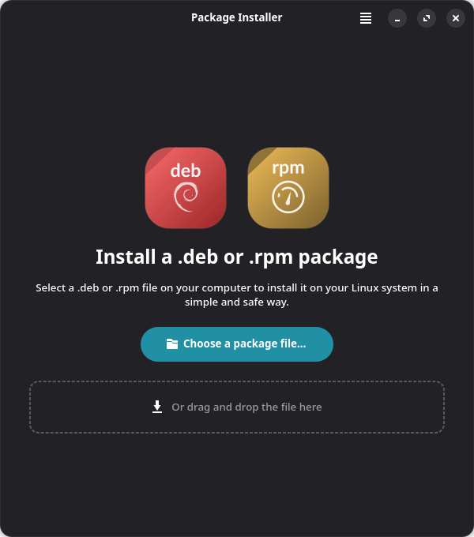
  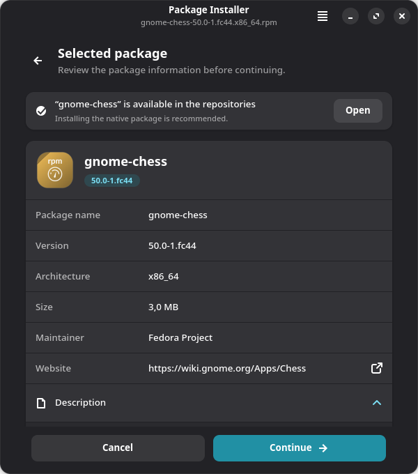
  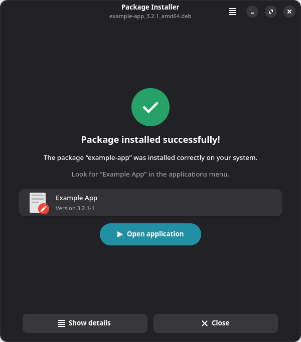
</p>

> **Prefer native packages when they exist.** Software from the official
> repositories, Flatpak or AppImage is built for this system and usually works
> better. debtap-mod is for programs that are only distributed as `.deb` or
> `.rpm`. When the repositories have a package with the same name, the
> installer says so before you continue.

---

## Contents

- [Features](#features)
- [Requirements](#requirements)
- [Installation](#installation)
- [Usage](#usage) — [graphical installer](#graphical-installer), [command line](#command-line), [apt / dnf translator](#apt--dnf-command-translator)
- [How it works](#how-it-works)
- [Troubleshooting](#troubleshooting)
- [Development](#development)
- [Credits and license](#credits)

## Features

- **Two formats.** `.deb` (Debian, Ubuntu, Mint) and `.rpm` (Fedora, openSUSE,
  RHEL), including RPM v4 and v6 with gzip, xz, bzip2, lzma or zstd payloads.
- **Graphical installer** built with GTK4 and libadwaita: opens on double click,
  accepts drag and drop, previews exactly what will be installed and shows real
  progress for every step.
- **Accurate dependencies.** The ELF binaries inside the package are read to
  find the libraries really needed; plugins loaded at runtime become optional
  dependencies; binaries for other architectures are ignored.
- **Exact transaction preview.** Before asking for a password, the installer
  runs a pacman dry run and lists every package that will be downloaded, with
  versions and size. Missing dependencies are reported before anything changes.
- **Install scripts that work.** Debian `preinst`/`postinst`/`prerm`/`postrm`
  and RPM `%pre`/`%post`/`%preun`/`%postun`/`%pretrans`/`%posttrans` run with the
  arguments dpkg or rpm would use, backed by compatibility shims.
- **Safe extraction.** Paths that escape the package are refused; file modes
  (setuid helpers such as `chrome-sandbox`) and owners are preserved.
- **Standard packaging.** Packages are built by `makepkg` under fakeroot, so
  ownership, `.MTREE` and `.BUILDINFO` are correct and `pacman -Qkk` passes.
- **Honest results.** Success is reported only after pacman confirms the
  package is installed; failures show the relevant error lines.
- **apt / dnf command translator.** Commands typed out of habit (`apt install`,
  `dnf upgrade`, `dpkg -i`…) are translated, explained in color and executed.
- **28 languages.**

## Requirements

- An Arch-based distribution (BigLinux, Manjaro, Arch Linux, …)
- `python` ≥ 3.14, `python-gobject`, `gtk4`, `libadwaita`
- `pacman` (provides `makepkg`), `pacman-contrib`, `fakeroot`, `libarchive`, `zstd`
- `polkit` (for `pkexec`)
- Up-to-date pacman file databases (`pacman -Fy`), used to resolve libraries
  that are not installed yet. They are usually refreshed automatically.

## Installation

On BigLinux, debtap-mod is available from the official repositories:

```sh
sudo pacman -S debtap-mod
```

To build from source:

```sh
git clone https://github.com/biglinux/debtap-mod.git
cd debtap-mod/pkgbuild
makepkg -si
```

## Usage

### Graphical installer

Double-click a `.deb` or `.rpm` file, or run:

```sh
debtap-gui package.deb
debtap-gui package.rpm
```

| | |
|---|---|
| 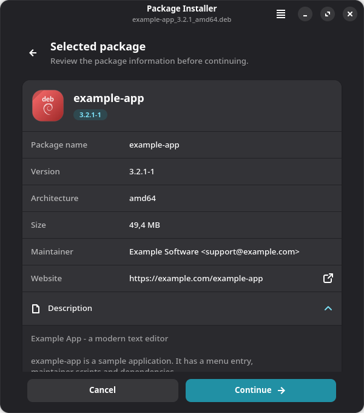 | **1. Selected package** — name, version, architecture, size, maintainer, website and description. A hint appears when a native package with the same name exists in the repositories. |
| 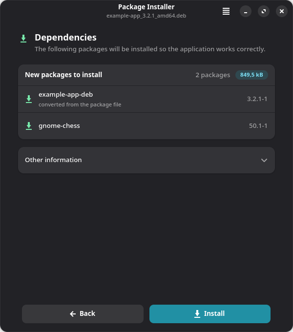 | **2. Dependencies** — the exact list of packages pacman will install, with versions and total size. *Other information* shows the final package name, the menu entry, warnings and the scripts that will run as administrator. |
| 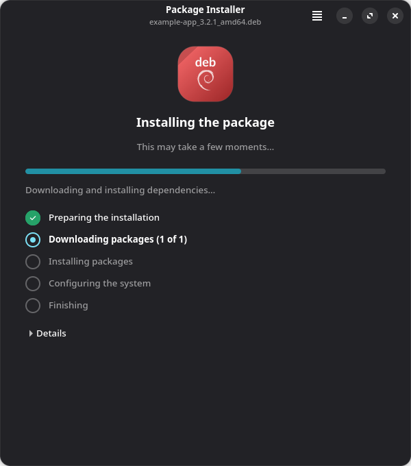 | **3. Installing** — after the system password prompt (polkit), progress follows pacman step by step: preparing, downloading, installing, configuring. |
|  | **4. Done** — shows the name used in the applications menu and offers to open the program. |

Other screens cover failed installations (with the relevant pacman error
lines), packages built for another architecture, damaged downloads and files
that are not packages at all:

<p align="center">
  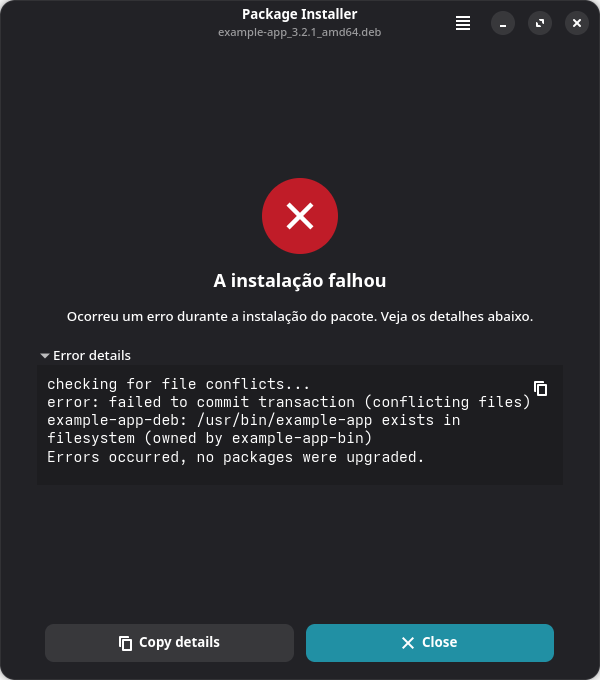
  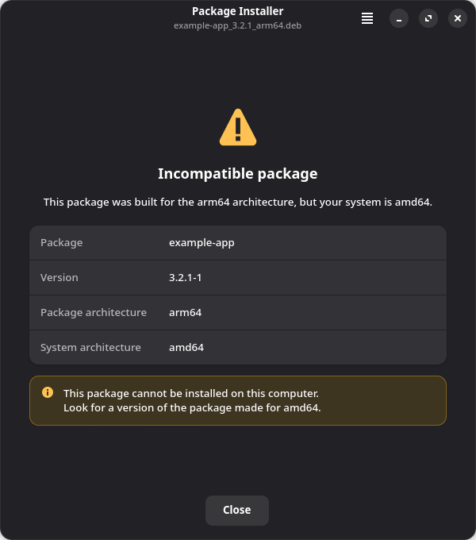
  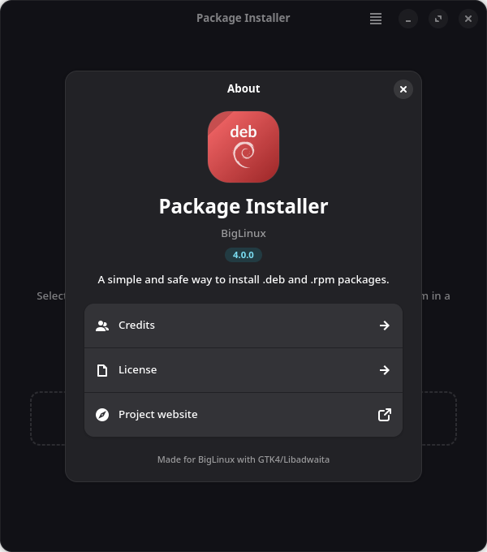
</p>

The menu offers **Preferences** (keep a copy of each converted package in a
folder of your choice), **Help**, **Send feedback** and **Report a problem**.

### Command line

```text
debtap-mod [options] package.deb|package.rpm

  -q, --quiet         no questions; open the install script in $EDITOR for review
  -Q, --Quiet         no questions at all
  -n, --no-install    build the package only
  -o, --output DIR    keep the built package in DIR
  -p, --pkgbuild      also write an AUR-style PKGBUILD next to the package file
  -P, --Pkgbuild      write the PKGBUILD only, do not build
  -v, --version       print the version
  -h, --help          show help
```

```sh
debtap-mod ~/Downloads/app_amd64.deb        # convert, review, confirm, install
debtap-mod -Q ~/Downloads/app.x86_64.rpm    # unattended installation
debtap-mod -n -o ~/packages app.rpm         # build ~/packages/app-rpm-*.pkg.tar.zst
debtap-mod -P app_amd64.deb                 # export ./app-deb/PKGBUILD
```

The historic `-u`, `-s` and `-w` options are accepted and ignored: no local
database needs to be updated any more.

### apt / dnf command translator

debtap-mod installs `apt`, `apt-get`, `apt-cache`, `apt-mark`, `dpkg`, `dnf`
and `yum` in `/usr/local/bin`. Commands typed out of habit are not rejected:
each one shows its pacman and pamac equivalents, then runs the right one.

<p align="center">
  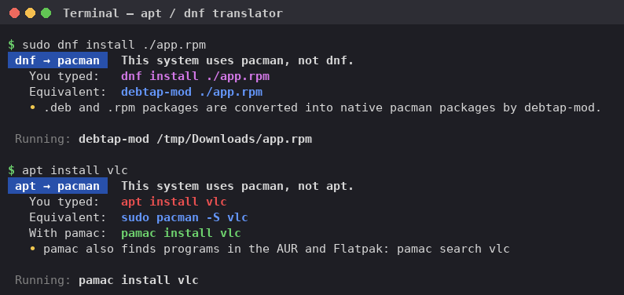
</p>

`apt help` and `dnf help` print a colored cheat sheet that adapts to the
terminal width; `apt help purge` shows only the rows about one command.

<p align="center">
  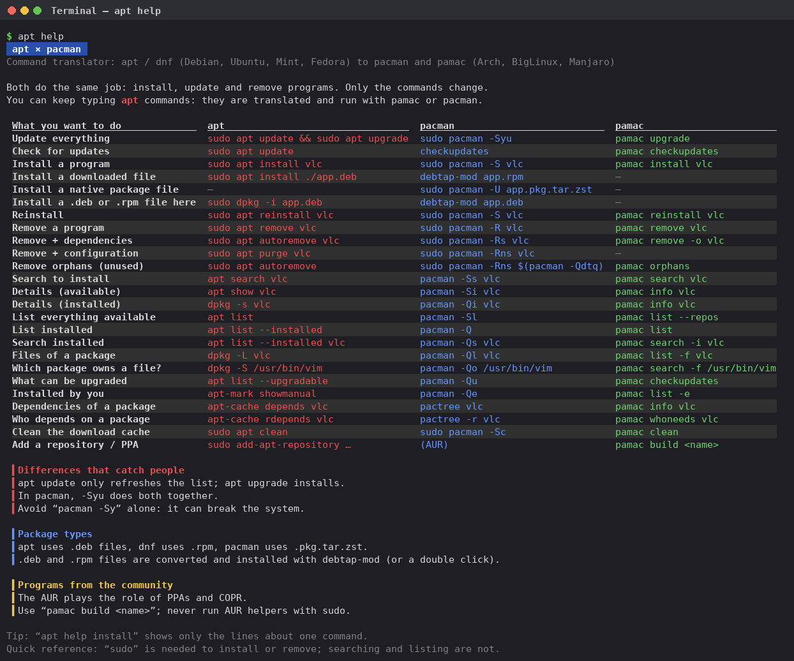
</p>

- `apt install ./app.deb`, `dpkg -i app.deb`, `dnf install ./app.rpm` and
  `yum localinstall app.rpm` convert and install the file with debtap-mod.
- `apt update` and `dnf check-update` only check for updates
  (`pamac checkupdates`); running `pacman -Sy` alone can cause partial upgrades.
- Changes run through pamac as a regular user, or pacman when already root.
- `dpkg --compare-versions` and `dpkg --print-architecture` answer silently,
  as installer scripts expect.
- The panel is written to stderr, so pipes such as
  `apt list --installed | grep vlc` keep working. Colors follow the terminal
  and `NO_COLOR`.
- A real `apt`, `dnf` or `dpkg` installed in `/usr/bin` takes precedence.

## How it works

| Stage | What happens |
|-------|--------------|
| **Read** | `.deb`: the `ar` container and the `control` archive. `.rpm`: the lead, signature and main headers (name, epoch, version, release, dependencies, scriptlets, configuration files, owners). Source RPMs are refused. |
| **Extract** | `.deb`: `data.tar` (gzip, xz, bzip2, zstd, lzma or plain). `.rpm`: the cpio payload in the classic or the "stripped" format used by RPM v6 and by packages with very large files. Entries escaping the package through `..` or a symlink are refused; modes, hard links and non-root owners are kept. |
| **Layout** | Merges `/bin`, `/sbin`, `/usr/sbin`, `/lib`, `/lib64`, `/usr/lib64` and the Debian multiarch directory into the Arch hierarchy, rewriting relative symlinks. Removes files that only make sense on the original distribution (lintian overrides, `/usr/lib/.build-id`, APT/YUM repository files). |
| **Dependencies** | Scans every ELF file, ignoring binaries for other architectures or C libraries (the ARM, musl and Android prebuilds Electron apps ship). Libraries are resolved with `ldconfig` and `pacman -F`; libraries loaded with `dlopen()` become optional dependencies. Declared dependencies are mapped through [`debian-names.toml`](usr/share/debtap-mod/debtap_mod/data/debian-names.toml) and [`rpm-names.toml`](usr/share/debtap-mod/debtap_mod/data/rpm-names.toml), including RPM rich dependencies such as `(git or mercurial)`. |
| **Scripts** | Maintainer scripts are embedded verbatim in the `.install` file and called as dpkg (`configure`, `upgrade <old>`, `remove`) or rpm (`1` install, `2` upgrade, `0` removal) would call them. Shims for `dpkg`, debconf, `deb-systemd-helper`, `adduser`, `update-alternatives`, `alternatives`, `semanage`, `restorecon`, `dnf`/`yum` come first in `PATH`. Lua scriptlets, which only run inside rpm, are skipped with a note. Repository files created by vendor scripts are removed. |
| **Build** | Writes a PKGBUILD and runs `makepkg` with zstd compression in `~/.cache/debtap-mod`. Work directories are always cleaned up, also after an interrupted run. |
| **Install** | Previews the transaction with `pacman -Up`, checks for file conflicts, runs `pkexec pacman -U` (or `sudo` from a terminal) and verifies the installed version with `pacman -Q`. |

### Package naming

Converted packages are named after the original package with a suffix that
shows where they came from: `chatgpt` becomes `chatgpt-deb` or `chatgpt-rpm`.
Each one declares `provides` and `conflicts` on the original name, so a system
upgrade never replaces it with an unrelated repository package of the same name.

### Package-specific adjustments

Some vendor packages need small fixes: extra dependencies, a different name,
files to remove or add, scripts to skip. They live in
[`quirks.toml`](usr/share/debtap-mod/debtap_mod/data/quirks.toml) and are
matched against the original package name, for both formats:

```toml
[[quirk]]
match = "warsaw"
name = "warsaw-deb"
elf_deps = false
remove_depends = ["java-runtime"]
add_depends = ["libcurl-gnutls"]
```

Supported keys: `name`, `elf_deps`, `clear_depends`, `add_depends`,
`remove_depends`, `skip_scripts`, `remove_files`, `post_install`, `note`,
`add_file` and `replace`. They are documented at the top of the file.

## Troubleshooting

**The program is not in the menu.** Look for the name shown on the last
screen: it comes from the package's `.desktop` file and may differ from the
file name. For example, the Codex desktop app is listed as **ChatGPT**.

```sh
pacman -Q | grep -E -- '-(deb|rpm) '         # converted packages
pacman -Ql chatgpt-deb | grep '\.desktop$'   # its menu entries
```

**Dependencies are not available.** The package needs something that the
repositories do not provide. The screen lists what pacman could not find;
look for an AUR package or a Flatpak of the program.

**The installation failed.** Open **Details** on the error screen, or run
`debtap-mod` from a terminal for the full pacman output. Common causes are
files that already belong to another package and a pacman database locked by
another package manager.

**The program installs but does not start.** Run it from a terminal to see
missing libraries or other errors. Libraries that were not found are listed
under *Warnings* before the installation.

**Removing a converted package:**

```sh
sudo pacman -R chatgpt-deb
```

## Development

The application runs directly from a checkout:

```sh
usr/bin/debtap-gui some.deb
usr/bin/debtap-mod -n -o /tmp/out some.rpm
usr/local/bin/apt help
```

Project layout:

```text
usr/bin/                       launchers (debtap-mod, debtap-gui, gdebi-gtk)
usr/local/bin/                 apt, apt-get, apt-cache, apt-mark, dpkg, dnf, yum
usr/share/debtap-mod/debtap_mod/
    package.py                 opens .deb or .rpm behind one interface
    debfile.py                 .deb reader
    rpmfile.py                 .rpm reader (headers, classic and stripped cpio)
    extract.py                 safe extraction shared by both formats
    layout.py                  filesystem hierarchy normalization
    elf.py                     minimal ELF parser
    deps.py, pacman.py         dependency resolution
    scripts.py                 maintainer scripts / scriptlets -> .install
    pkgbuild.py                PKGBUILD generation and makepkg
    installer.py               transaction preview, installation, verification
    converter.py               conversion pipeline
    cli.py                     command-line interface
    pkgcompat.py               apt/dnf/dpkg command translator
    settings.py                user preferences
    gui/                       GTK4 + libadwaita interface
    data/                      name mappings and package quirks
tests/                         pytest suite (real .deb and .rpm files are built on the fly)
locale/                        gettext catalogs
```

Run the checks before submitting changes:

```sh
pytest                  # unit tests and end-to-end makepkg builds (nothing is installed)
pytest -m "not slow"    # unit tests only
ruff check usr tests
```

The RPM tests use `rpmbuild` (package `rpm-tools`) to build real packages;
they are skipped when it is not installed.

### Translations

User-facing strings use gettext (domain `debtap-mod`). Catalogs for 28
languages live in `locale/`, and the compiled `.mo` files in
`usr/share/locale/`. After changing strings, regenerate the template and
compile the catalogs:

```sh
xgettext --package-name=debtap-mod --no-location -L Python -k_ -kngettext:1,2 \
    -o locale/debtap-mod.pot $(find usr/share/debtap-mod -name '*.py')
for po in locale/*.po; do
    lang=$(basename "$po" .po)
    msgmerge -U "$po" locale/debtap-mod.pot
    msgfmt -o "usr/share/locale/$lang/LC_MESSAGES/debtap-mod.mo" "$po"
done
```

## Credits

debtap-mod started as a fork of [debtap](https://github.com/helixarch/debtap)
by George Savvidis. It is maintained by the [BigLinux](https://www.biglinux.com.br)
community. Version 4 is a complete rewrite in Python.

## License

GNU General Public License v2.0 or later. See [LICENSE](LICENSE).
